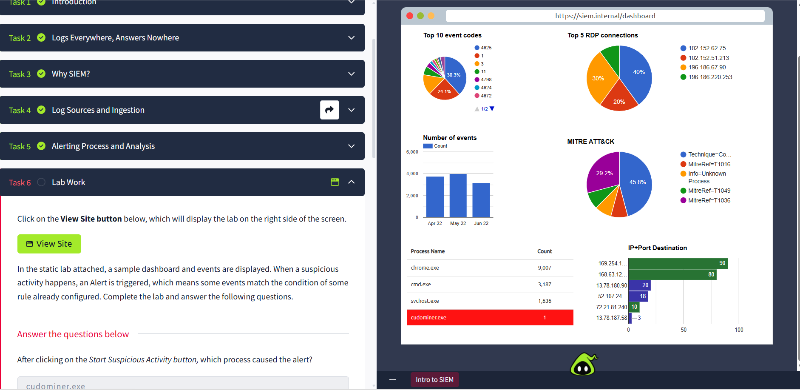

# 📂 SOC Analyst Lab – SIEM Basics

## 📌 Project Description

In this document, I describe my completion of the TryHackMe's "Intro to SIEM" challenge. I have explained the concept of how the Security Information and Event Management (SIEM) tool is employed in Security Operations Centre (SOC).

The lab involves log collection, event correlation, alerting, and investigation.

---

## 🧠 What is SIEM?

SIEM system gathers and analyzes security logs from various sources in order to detect any suspicious activity and trigger alerts.

---

## ✍🏼 Lab Objectives

- Understanding SIEM architecture and components

- Examining log sources and event types

- Performing log searches and filtration

- Reviewing alerts generated by the SIEM

---

## 🖥️ Concepts Learned

### 1. Log Collection

Logs are collected from various sources:

  - servers

  - network devices

  - applications

  - security products

### 2. Log Analysis

- logs are analyzed in order to identify anomalies 

- filters and queries are used to investigate the events

### 3. Event Correlation

- SIEM correlates several events in order to identify potential threats 

- helps reduce false positives

### 4. Alerting 

- Alerts are triggered by rules

- Helps SOC analysts prioritize incidents

---

## 💾 Tools Used

- TryHackMe SIEM Lab Environment

- SIEM Dashboard Interface

---

## 🗝️ Key Takeaways

- SIEM is an essential component for real-time threat detection

- Log analysis is one of the key tasks of SOC analyst

- Event correlation increases the detection precision

- Alerts assist in prioritization of security incidents

---

## 📚 Skills Demonstrated

- SIEM fundamentals

- Log analysis and filtration

- Events investigation

- Security monitoring principles

---

## 📸 Evidence

### Task Completion

### SOC Dashboard

