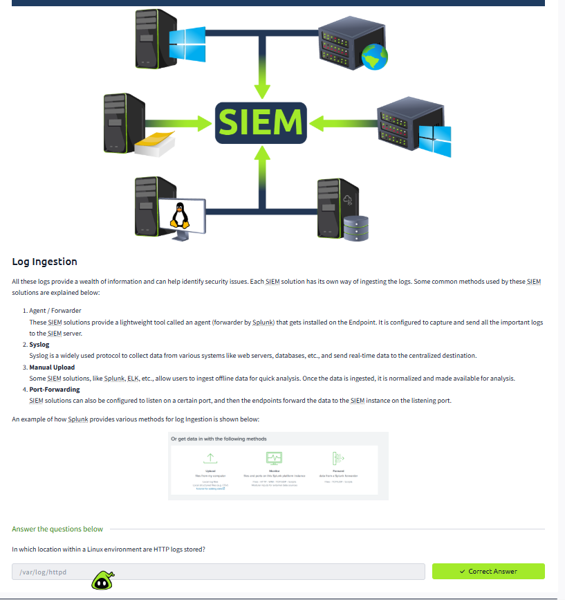
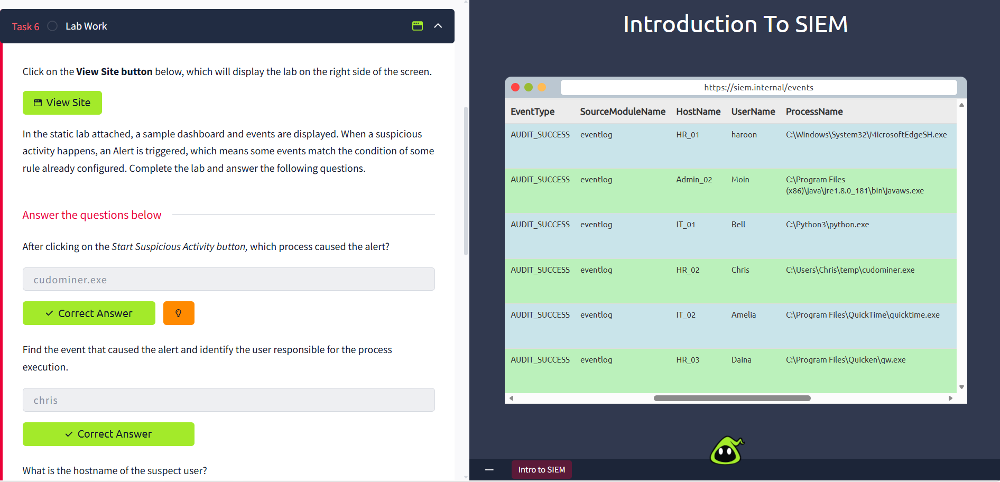
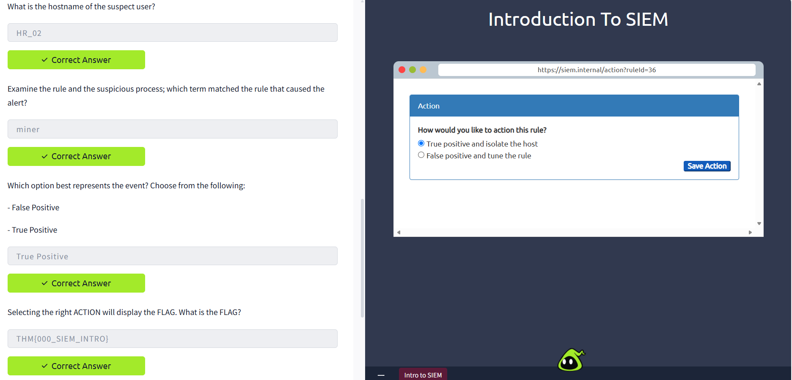

# 📂 SOC Analyst Lab – SIEM Fundamentals & Log Analysis

## 📌 Project Description

In this document, I describe my completion of the TryHackMe's "Intro to SIEM" challenge. I have explained the concept of how the Security Information and Event Management (SIEM) tool is employed in Security Operations Centre (SOC).

The lab involves log collection, event correlation, alerting, and investigation.

---

## 🧠 What is SIEM?

SIEM system gathers and analyzes security logs from various sources in order to detect any suspicious activity and trigger alerts.

---

## ✍🏼 Lab Objectives

- Understanding SIEM architecture and components

- Examining log sources and event types

- Performing log searches and filtration

- Reviewing alerts generated by the SIEM

---

## 🖥️ Concepts Learned

### 1. Log Collection

Logs are collected from various sources:

  - servers

  - network devices

  - applications

  - security products

### 2. Log Analysis

- logs are analyzed in order to identify anomalies 

- filters and queries are used to investigate the events

### 3. Event Correlation

- SIEM correlates several events in order to identify potential threats 

- helps reduce false positives

### 4. Alerting 

- Alerts are triggered by rules

- Helps SOC analysts prioritize incidents

---

## 🧪 SIEM Investigation Hands-on Practice

I did the following with the SIEM dashboard during the lab:

- Conduct searches and filters on logs with queries
- Investigate authentication and system events
- Identify patterns in logs
- Verify alerts generated from correlation rules

Examples of what I have done:

- Filter logs based on event type
- View login activities
- Understand how an alert is generated based on suspicious activities

---

## 💾 Tools Used

- TryHackMe SIEM Lab environment
- SIEM Dashboard Interface
- Log search & filter interface
- Alert Monitoring system

---

## 🗝️ Key Takeaways

- SIEM is an essential component for real-time threat detection

- Log analysis is one of the key tasks of SOC analyst

- Event correlation increases the detection precision

- Alerts assist in prioritization of security incidents

---

## 🔄 Workflow of SOC Demonstrated

1. Collection of logs from multiple sources
2. Observation of events on the SIEM dashboard
3. Creation of alerts from detection rules
4. Initial alerts check
5. Investigation of suspicious events

---

## 🌐 MITRE ATT&CK mapping

| Technique | Description |
|---|---|
| T1110 | Brute Force (multiple login attempts) |
| T1078 | Valid Accounts (login activity) |

---

## 📚 Skills Demonstrated

- SIEM fundamentals

- Log analysis and filtration

- Events investigation

- Security monitoring principles

---

## 🗃️ Lessons Learned

- SIEM collects logs from multiple locations
- It is essential to have effective log filters
- Proper analysis of the alerts helps to prevent false positives
- It is important to know the difference between normal and abnormal behavior

---

## 🔗 Cyber Kill Chain Mapping

This attack is able to be mapped to the Cyber Kill Chain as follows:

- Reconnaissance → External scanning activity 
- Delivery → SSH login attempts
- Exploitation → Successful login detected

---

## 🎯 Project Impact

The lab demonstrates practical proficiency in the use of SIEM tools, log analysis, and alert validation, which aligns with the core responsibilities of a Tier 1 SOC Analyst.

---

## 📸 Evidence

### Task Completion

### SIEM Dashboard

